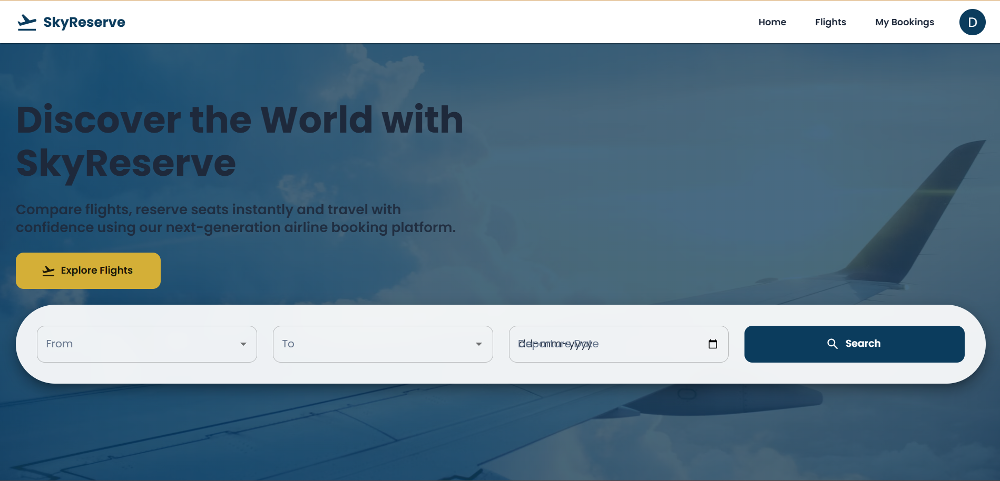
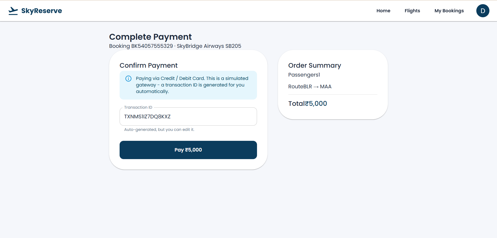

# ✈️ SkyReserve

SkyReserve is a full-stack airline reservation and management system. Users can search flights, select seats in real time, and book tickets with idempotent payments — while admins manage airlines, aircraft, airports, and flights through a dedicated dashboard.

**🔗 Live Demo:** [skyreserve.vercel.app](https://skyreserve.vercel.app)
**📄 API Docs (Swagger):** [skyreserve-backend.onrender.com/api-docs](https://skyreserve-backend.onrender.com/api-docs)

> **Note:** The backend is hosted on Render's free tier, which spins down after 15 minutes of inactivity. The first request may take 30–60 seconds to wake it up — please be patient on first load!

### Demo Credentials

| Role  | Email                  | Password     |
|-------|-------------------------|--------------|
| Admin | admin@skyreserve.com    | Admin@123    |
| User  | demo@skyreserve.com     | Demo@1234    |

---

## Screenshots

<!--
  Add your screenshots to a `docs/screenshots/` folder in the repo root, then
  reference them below. Recommended shots (in this order tell the story best):
    1. home.png            – Landing page
    2. flight-search.png   – Search results for a route
    3. seat-selection.png  – Interactive seat map
    4. booking.png         – Booking / passenger details page
    5. payment.png         – Payment page
    6. my-bookings.png     – Booking confirmation / history
    7. admin-dashboard.png – Admin panel (any tab, e.g. Flights or Airlines)
-->

| | |
|---|---|
| **Home**  | **Flight Search**  |
| **Seat Selection**  | **Payment**  |
| **My Bookings**  | **Admin Dashboard**  |

---

## Highlights

This isn't just a CRUD app — a few pieces were specifically built to handle real-world booking-system problems:

- **Distributed seat locking with Redis** — when a user selects a seat, a short-lived lock (`SET NX EX` + a Lua script for safe token-based release) prevents two people from booking the same seat at once. Locks are also tied to the user's Socket.IO connection, so if their browser tab closes or the connection drops, the seat is released automatically and other users see it become available in real time.
- **Idempotent payments** — every checkout generates a unique idempotency key, sent as a header and enforced by a unique DB constraint, so retried/duplicate payment requests (e.g. from a flaky network) can never create two charges for the same booking.
- **Atomic booking transactions** — booking creation, passenger records, and seat status updates all happen inside a single Prisma transaction, so a failure partway through can't leave the database in an inconsistent state.
- **JWT access + refresh token flow** — short-lived (15 min) access tokens paired with a 7-day refresh token delivered via an httpOnly cookie, with a single-flight refresh queue on the frontend so concurrent 401s don't trigger multiple refresh requests.

## Tech Stack

**Backend**
- Node.js + Express (modular architecture: controller → service → repository per domain)
- Prisma ORM + MySQL
- Redis (seat locking / distributed locks)
- Socket.IO (real-time seat release updates)
- JWT authentication (access + refresh tokens, httpOnly cookies)
- Jest + Supertest (test suite)
- Swagger / OpenAPI (API docs)
- Helmet, CORS, rate limiting, centralized error handling

**Frontend**
- React 19 + Vite
- Material UI (MUI)
- React Router
- Axios (with silent token-refresh interceptor)
- Socket.IO client
- Formik + Yup (forms & validation)
- Framer Motion

**Infrastructure (deployed)**
- Frontend: [Vercel](https://vercel.com)
- Backend: [Render](https://render.com)
- Database: [Aiven](https://aiven.io) (managed MySQL)
- Cache / locking: [Upstash](https://upstash.com) (managed Redis)

## Features

- User registration, login, and JWT-based auth with refresh tokens
- Role-based access control (Admin / Customer)
- Flight search and filtering by route and date
- Interactive seat map with live availability
- Real-time seat lock release via WebSockets
- Booking flow with passenger details, wrapped in a DB transaction
- Idempotent payment processing (Card / UPI / Net Banking / Wallet)
- Booking history ("My Bookings")
- Admin dashboard — manage airlines, aircraft, airports, flights, and users
- Rate limiting, Helmet security headers, centralized error handling
- CI pipeline (GitHub Actions) running the full test suite against real MySQL + Redis services on every push

## Project Structure

```
skyreserve/
├── backend/
│   ├── src/
│   │   ├── modules/         # auth, user, admin, airport, airline, aircraft,
│   │   │                    # flight, flightSeat, booking, payment — each with
│   │   │                    # its own controller/service/repository/routes/validator
│   │   ├── middleware/       # auth, error handling, rate limiting
│   │   ├── config/           # env, database, redis
│   │   ├── utils/             # redis locking, retry logic, cookie options, etc.
│   │   └── socket.js          # Socket.IO server + auth
│   ├── prisma/                 # schema, migrations, seed script
│   └── tests/                   # Jest + Supertest suites
└── frontend/
    └── src/
        ├── pages/              # Home, Flights, SeatSelection, Booking, Payment,
        │                       # MyBookings, Admin, Login, Register, etc.
        ├── components/         # reusable UI (seat map, flight cards, layout)
        ├── context/            # AuthContext, SocketContext
        ├── services/           # API service layer, matches backend routes 1:1
        ├── api/                 # axios instance + token refresh interceptor
        └── routes/              # ProtectedRoute, AdminRoute
```

## Getting Started (Local Setup)

### Prerequisites

- Node.js 20+
- MySQL (local or Docker)
- Redis (local or Docker)

### 1. Clone the repo

```bash
git clone https://github.com/MADHUMITHA-TV/skyreserve.git
cd skyreserve
```

### 2. Backend setup

```bash
cd backend
npm install
cp .env.example .env
```

Fill in `.env` with your local values — see `.env.example` for every variable and what it's for (`DATABASE_URL`, `REDIS_URL`, JWT secrets, etc.).

```bash
npx prisma migrate dev
npx prisma db seed
npm run dev
```

Backend runs on `http://localhost:5000` by default. API docs available at `http://localhost:5000/api-docs`.

### 3. Frontend setup

```bash
cd ../frontend
npm install
cp .env.example .env
npm run dev
```

Frontend runs on `http://localhost:5173` by default.

### 4. Run tests

```bash
cd backend
npm test
```

Requires a running MySQL and Redis instance (see `.env.test` for test DB config).

## Deployment Notes

- Backend and frontend are deployed separately (Render + Vercel), so **CORS is environment-driven** — set `CLIENT_URL` on the backend to your deployed frontend's origin.
- Refresh-token cookies switch to `secure: true` / `sameSite: "none"` automatically in production (`NODE_ENV=production`) to work across the two separate domains.
- The frontend needs `VITE_API_BASE_URL` and `VITE_SOCKET_URL` set at **build time** (Vite bakes these in), pointing at the deployed backend.
- A `vercel.json` rewrite rule is required for client-side routing (React Router) to work correctly on direct navigation/refresh.

## Possible Future Improvements

- Dynamic pricing (currently a flat rate per passenger)
- Fare classes (Economy / Business)
- Email notifications for booking confirmation
- Code-splitting the frontend bundle (currently a single large chunk)

## License

This project is for educational/portfolio purposes.
